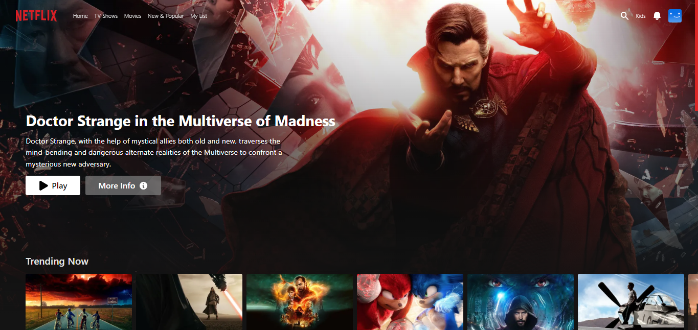
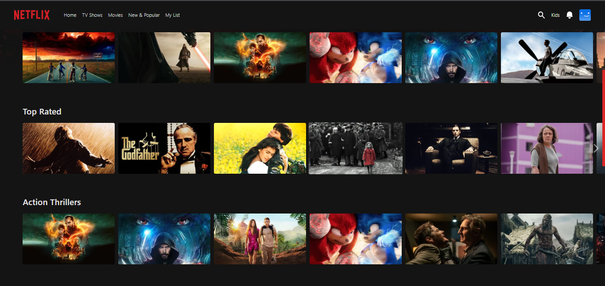
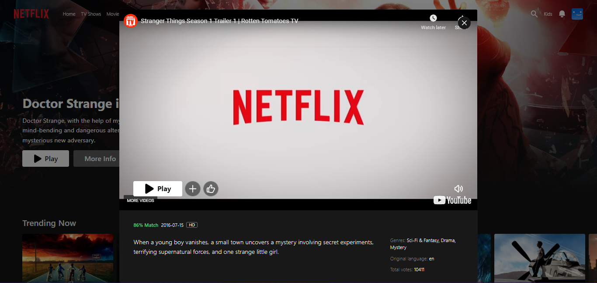
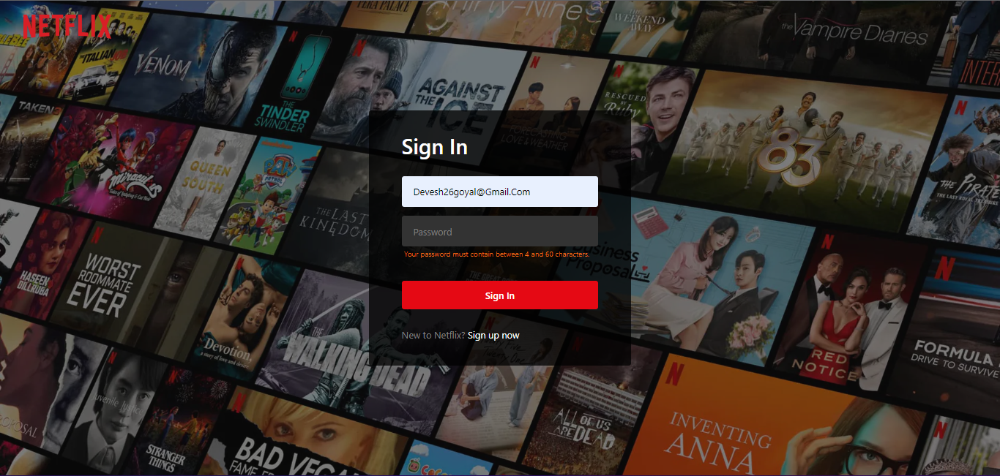
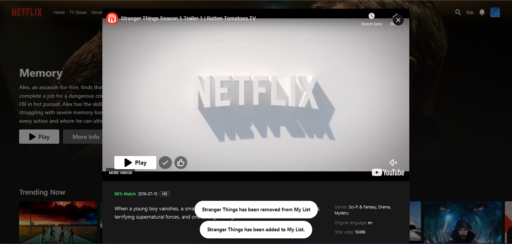
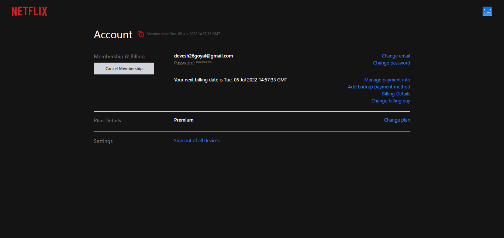
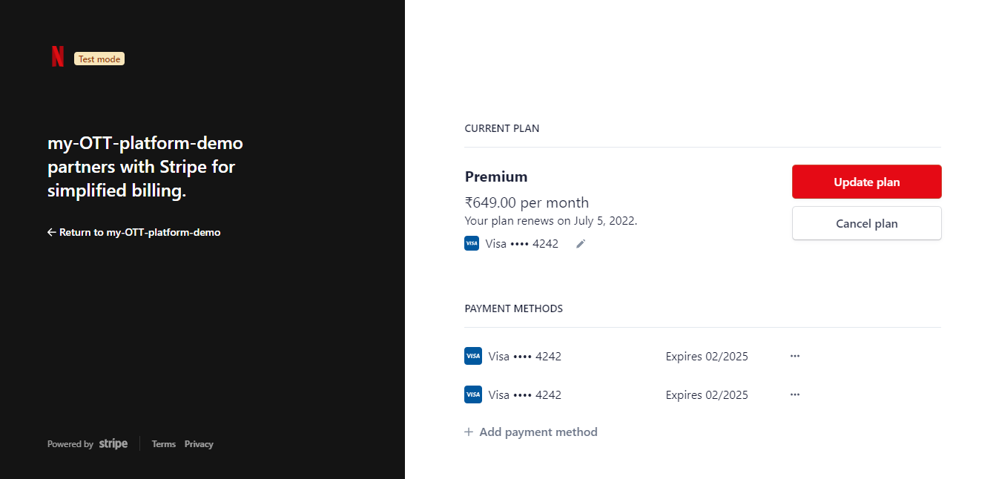
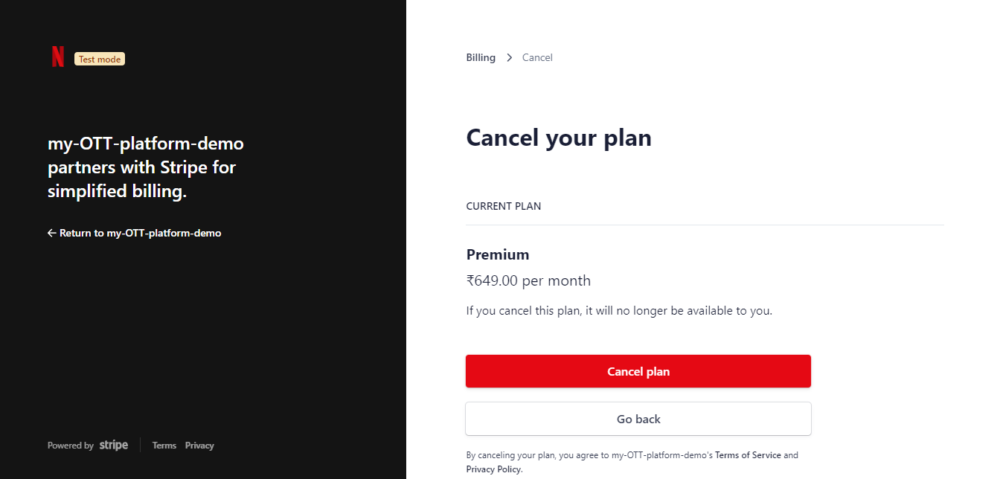
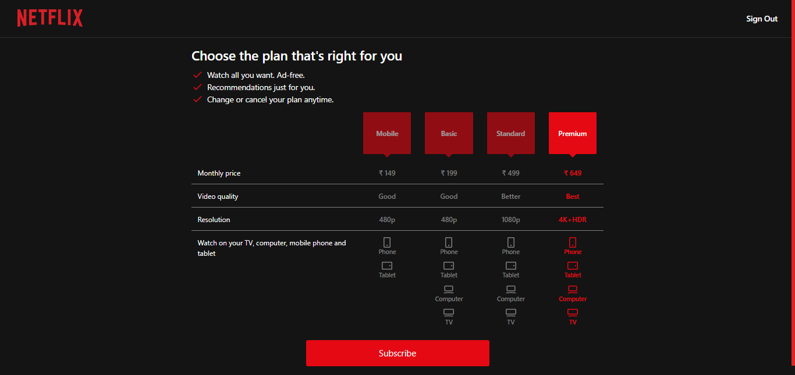
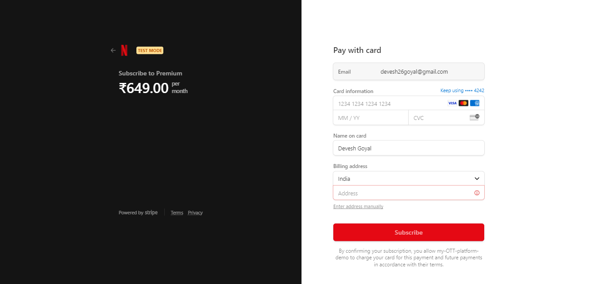

# Netflix

Netflix is a  is an American subscription streaming service and production company. Here you will find all types of movies tv 
shows to watch and enjoy with your friends and family.
This is one my side projects as well. In this project I tried to build erverything with some online tutorial's and I am happy with it. 
I tried to use those library's which, I was not good at or I was not familiar with. Because of this I was able to make a good looking website and
was able to learn more and was able to get out of my comfort zone.

here is the link to checkout the site - [click here](https://netflix-clone-qy2y4totb-deveshgoyal26.vercel.app/).

## Tech Stack
- Tailwind 
- React 
- Firebase 
- themoviedb Api 
- Typescript
- Stripe payment method
- Account management

## Inspiration material
- Netflix  [netflix](https://www.netflix.com/in/)

## Features

- Random Slides of movies
- Movies slider
- Individual moive info
- Movie trailer functionality
- Server side rendering
- Login and Sign in authentication with firebase

## Screenshots

## Conclusions
- I had so much fun building this website that I want to build some more. Even though I had to scrifice some of my free time to build it
  and during that time I had so many difficulties but i am so happy with it and I am so glad that I stuck through it and made to the end.

